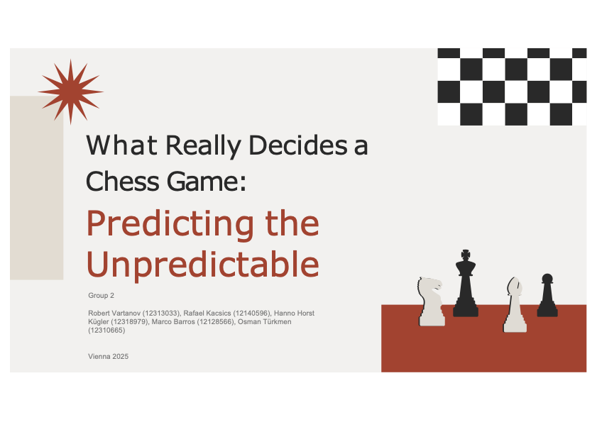

\newpage

# Introduction



## A Brief Overview of Chess Enginges History
 
Chess has fascinated players for centuries. It goes far beyond a simple games - it's a test of memory, strategy, and psychological endurance. Historically, it has outlasted empires, adapted to new cultures, and thrived in every age — from royal courts to online blitz arenas. Today, millions play it daily, drawn by its blend of simplicity and depth.
 
Chess has also captivated minds of countless programmers for reasons articulated by the genius mathematician and the father of chess engines, Claude Shannon, in his paper *XXII. Programming a Computer for Playing Chess* (published 1950):
 
> "The chess machine is an ideal one to start with, since: (1) the problem is sharply defined
both in allowed operations (the moves) and in the ultimate goal (checkmate); (2) it is
neither so simple as to be trivial nor too difficult for satisfactory solution; (3) chess is
generally considered to require "thinking" for skilful play; a solution of this problem will
force us either to admit the possibility of a mechanized thinking or to further restrict our
concept of "thinking"; (4) the discrete structure of chess fits well into the digital nature of
modern computers."
 
 
This groundbreaking paper laid the foundation for all subsequent research in computer chess, with many strong engines relying on the core principles Shannon outlined. To be precise, a typical chess engine consists of two primary components: an evaluation function which evaluates how good a given position is, and a search algorithm responsible for determining which positions to evaluate. Over time, incremental improvements to both elements — combined with exponential growth in computational power — culminated in the historic 1997 victory of IBM’s Deep Blue over reigning World Champion Garry Kasparov. This milestone marked the first time a machine defeated a human world champion.
 
Remarkably, this achievement was realized without fundamentally altering the evaluation function from its early conceptualizations. Instead, success relied on brute-force search techniques enhanced by relatively simple heuristics and access to vastly superior hardware. Attempts to design programs that emulate human-like pattern recognition — evaluating positions based on strategic understanding rather than calculation — consistently failed. These efforts underscored a key limitation: the patterns governing chess positions are difficult to formalize and generalize. While engines surpassed humans in tactical calculation, they lacked any form of intuitive comprehension of the game.
 
This paradigm shifted in 2017 with the introduction of AlphaZero by DeepMind. Unlike traditional engines, AlphaZero employed a deep neural network trained via reinforcement learning to evaluate positions and guide search. In matches against Stockfish, the strongest classical engine at the time, AlphaZero achieved a dominant score of 28–0, demonstrating that machines could develop a strategic understanding of chess independent of human input. Crucially, it did so without hand-crafted evaluation functions or domain-specific heuristics — learning instead by playing millions of games against itself.
 
Today, the strongest chess engines employ neural networks to model their evaluation functions, rendering traditional feature engineering obsolete. Human players no longer aspire to surpass engines in skill, but instead study engine games to derive novel strategic concepts. Chess - once a human endeavor augmented by computation - is now increasingly shaped by ideas generated by AI engines.
 
 \newpage

## Research Objectives

Having established the historical context, we can now elaborate on the motivation behind our work and the limitations of current approaches.
 
In recent years, the popularity of chess has surged, driven by a growing base of new and intermediate players. For these players, following and understanding the course of a game in real time can be challenging. Most major chess platforms display engine evaluations during broadcasts or analyses, typically offering a numeric assessment of the position. However, this information is not always sufficient — or even appropriate — for predicting the game’s outcome.
 
The underlying assumptions made by modern engines contribute to this gap. Chief among them is the notion that both players will play optimally, that is, at a level matching the engine's performance. This leads to two fundamental issues when using engine evaluation as a proxy for outcome prediction: 

1.	Even the strongest human players, including world champions, are unable to calculate or evaluate at a level comparable to top engines. 
	
2.	Humans also require significantly more time to evaluate even a small subset of the positions that engines process almost instantly. 
 
As a result, relying solely on engine evaluation often produces misleading expectations about the likely winner, especially in games between humans rather than engines. This leads us to our research question:
 
`Can probabilities of outcomes in a chess game be predicted using in-game metrics?`
 
While this question takes the form of a classification problem, our focus extends beyond simple accuracy. It is of the utmost significance to note that chess is often characterized as a game of one move — where a single error can instantly flip a winning position into a losing one. Therefore, the accuracy function becomes more precise as the game progresses. This relationship can be described mathematically as follows:


$$
\begin{aligned}
f(n) &= \frac{n}{N}, \quad n \in \mathbb{N}_0,\ N \in \mathbb{N}_+,\ n \leq N; \quad \text{therefore, } f(n) \in [0,1] \\
A(f) &= A_0 + (A_{\text{max}} - A_0) \cdot g(f), \quad
\text{with } g(0) = 0,\ g(1) = 1,\ g'(f) \geq 0,\  A_{\text{max}} < 1
\end{aligned}
$$

where:

- \( n \): current move number or ply (half-move)  
- \( N \): total number of moves or plies in the game  
- \( f(n) \): game progress  
- \( A(f) \): accuracy of prediction at progress level \( f \)  
- \( A_0 \): baseline accuracy at the start of the game  
- \( A_{\text{max}} \): upper limit of accuracy  
- \( g(f) \): arbitrary monotonically increasing function \( [0,1] \rightarrow [0,1] \)

Moreover, achieving perfect prediction accuracy is unattainable, even if all moves are known. For instance, one could resign in a winning position - a situation that occurs more often than expected. Thus, we can choose freely whatever move we want so as to assess the accuracy. In an ideal scenario, we would evaluate every move, however, due to RAM limitations we restricted the analysis to a single move per game.
 
 
Furthermore, we want to highlight that accuracy is not our only goal. Beyond accuracy, we also aim for calibration - ensuring that the predicted probabilities of outcomes correspond to actual outcomes as closely as possible.

$$
\text{Perfect Calibration:} \quad \hat{P}(y \mid x) = P(y \mid x)
$$

Unfortunately, we can not recreate the same position between the same players for hundreds of times due to obvious reasons, that is why we measure the results in the sample instead, formally:

$$
\text{If } \hat{P}(y \mid x) = p, \text{ then roughly } p \times 100\% \text{ of elements in the set } \{x_i \mid \hat{P}(y \mid x_i) = p\} \text{ should satisfy } y_i = y.
$$
A well calibrated model provides great insight to players of all strengths.
 
In the following chapter, we describe the data sets used to address these two problems.
 \newpage

## Data Overview:
 
### Evaluation:
 
As already outlined in the historical overview, the difficulty of generalizing chess patterns led us to avoid constructing a custom position evaluation function. Instead, we rely on evaluations produced by Stockfish 12 — a powerful, well-established engine that follows classical, non-neural principles. Its assessments serve as a central input in our model.
 
Stockfish reports position evaluations in units called pawns. Although named after a tangible piece, this unit does not imply a literal material advantage. Rather, a value of +1.0 indicates that the engine believes White has an advantage equivalent to one pawn, all else being equal; -1.0 indicates the same for Black. In amateur games, evaluations tend to fluctuate between +3 and -3. Among professionals, an advantage of just 1.0 is often sufficient to secure a win, though exceptions exist.
 
### Average Centipawn Loss & Standard Deviaton:
 
To quantify the precision of moves made by players, a commonly used metric is average centipawn loss (ACPL). This measures the average change in evaluation after each move compared to the optimal move suggested by the engine. If the player’s move exactly matches the engine’s choice, the evaluation remains unchanged and the centipawn loss for that move is zero.
 
The formula for centipawn loss after a move is described as follows:

$$
\text{ACPL}_c = \frac{\sum_{i=1}^{N_c} \left| E_{i,c}^{\text{after}} - E_{i,c}^{\text{before}} \right|}{N_c}
$$

$$
\begin{array}{ll}
N_c & \text{total number of moves made by the player} \\
E_{\text{before}_{i,c}} & \text{evaluation in centipawns before move } i \\
E_{\text{after}_{i,c}} & \text{evaluation in centipawns after move } i \\
|E_{\text{after}_{i,c}} - E_{\text{before}_{i,c}}| & \text{change in evaluation caused by the move} \\
\end{array}
$$

\[
\begin{aligned}
\text{Notes: subscript } c \text{ denotes the color of the player (White or Black),} \\
\text{Centipawn equals one hundredth of a pawn (1 pawn = 100 centipawns).}
\end{aligned}
\]

Additionally, we calculated the standard deviation of average centipawn loss. In theory, it should capture the sharpness of the game, meaning how often blunders/mistakes are made.

$$
\text{SDCPL}_c = \sqrt{ \frac{ \sum_{i=1}^{N_c} \left( \left| E_i^{\text{after}} - E_i^{\text{before}} \right| - \text{ACPL}_c \right)^2 }{N_c} }
$$


### Elo-rating & Other Variables
 
Player strength is traditionally measured using the Elo rating system which is a widely adopted model in chess and other competitive games. This system rates a player’s skill level based on previous game outcomes against opponents of also known ratings. A higher rating indicates higher skill, while gains and losses are calculated after each match according to the player performance relative to expectation. In practical terms, an Elo difference of 200 points implies a clear skill gap: the higher-rated player is expected to win approximately 75% of the time.
 
In the following chapters, we provide a brief description of all columns used in the analysis. It is important to note that one of the data sets was sourced externally and contained a number of extraneous variables. As part of the initial pre-processing steps, the majority of these were removed to retain only the relevant information for our modeling purposes.
 
 
### Data Set 1
 
 
This data set contains metadata from over 130,000 chess games played in January 2024, collected from the Lichess.org platform. Originally sourced from Kaggle under the MIT License (open-source license with minimal restrictions), the authors for this data set are Maksym Shkarupylo, Ivan Omelchenko and Oleg Pazyuka.  

Looking closely at the data, each observation represents a single game and includes metadata such as the event, player usernames and elo ratings, game outcome, opening classification and other contextual variables.


 
 
Variables:

- `GameID`: Unique identifier for each game.
- `Event`: Name or type of the chess event or tournament.
- `Round`: Sequence number of the game within the event.
- `Site`: URL to the Lichess game.
- `Date`: Date the game was played.
- `Time`: Time the game started.
- `White`: Username of the player playing with white pieces.
- `WhiteElo`: Elo rating of the white player at the time of the game.
- `WhiteRatingDiff`: Rating change for the white player resulting from the game.
- `White_is_deleted`: Boolean indicating if the white player's account has been deleted.
- `White_tosViolation`: Boolean indicating if the white player violated Lichess terms of service.
- `White_profile_flag`: Indicates whether there is a country flag on the white player’s profile.
- `White_createdAt`: Unix timestamp of white player's account creation.
- `White_playTime_total`: Total playtime in seconds for the white player on the platform.
- `White_count_all`: Total number of games played by the white player.
- `White_title`: Chess title of the white player (e.g., GM, IM, FM), if applicable.
- `Black`: Username of the player playing with black pieces.
- `BlackElo`: Elo rating of the black player at the time of the game.
- `BlackRatingDiff`: Rating change for the black player resulting from the game.
- `Black_is_deleted`: Boolean indicating if the black player's account has been deleted.
- `Black_tosViolation`: Boolean indicating if the black player violated Lichess terms of service.
- `Black_profile_flag`: Indicates whether there is a country flag on the black player’s profile.
- `Black_createdAt`: Unix timestamp of black player's account creation.
- `Black_playTime_total`: Total playtime in seconds for the black player. 
- `Black_count_all`: Total number of games played by the black player.
- `Black_title`: Chess title of the black player, if any.
- `Moves`: String containing the full move history in algebraic notation, including evaluation and clock comments.
- `TotalMoves`: Total number of moves (ply) in the game.
- `ECO`: Encyclopaedia of Chess Openings code.
- `Opening`: Name of the opening played in the game.
- `TimeControl`: Time control used (e.g., "60+0" = 60 seconds, no increment per move).
- `Termination`: How the game ended (e.g., checkmate, resignation, timeout).
- `Result`: Game result — "1-0" (White wins), "0-1" (Black wins), or "1/2-1/2" (draw).


### Data Set 2
 
Firstly, we wanted to use **Dateset 1** as our primary source. However, it quickly became clear that several in-game metrics crucial for our planned analysis, especially those related to evaluation, were missing.
 
Thus, using the Lichess API, we collected data from the same 130,000+ chess games played in January 2024, including dynamic variables such as: Evaluation after each halfmove (= each single move of either white or black), Time left after the halfmove for each player (absolute and relative) , Phase of the game (opening, middlegame, endgame) and indicators of move accuracy based on the Stockfish engine assessments (per move and game average).


Variables:

- `Number_of_moves`: Half-move index, starting from 0.
- `Player_to_move`: Factor indicating whether it's White or Black to move.
- `Eval`: Engine evaluation after the move (in pawn units, positive = good for White). 
- `White_time_left`: Time remaining for White (in seconds).
- `Black_time_left`: Time remaining for Black (in seconds).
- `White_time_left_pct`: White's remaining time as a percentage of the starting time.
- `Black_time_left_pct`: Black's remaining time as a percentage of the starting time.
- `Stage_of_the_game`: Factor indicating the phase of the game — opening, middle, or endgame.
- `Site`: URL to the Lichess game.
- `White_cpl`: Centipawn loss for White on this move. (The difference between evaluation after the best move and the made move)
- `Black_cpl`: Centipawn loss for Black on this move.
- `White_cpl_avg`: Average centipawn loss for White up to the current move.
- `Black_cpl_avg`: Average centipawn loss for Black up to the current move.
- `White_stdv`: Standard deviation of White's CPL so far.
- `Black_stdv`: Standard deviation of Black's CPL so far.

\newpage

# Workflow
For this part we are going to present it in a way that is simmilar to assignments, however, in order to keep the scope of the project manageable,  we do not include failed attempts, leaving only interesting findings.

## Basic Preprocessing & Cleaning  


### Loading and Cleaning
```{r echo=TRUE, message=FALSE, warning=FALSE, paged.print=FALSE}
library(ggplot2)
library(dplyr)
library(corrplot)
library(stringr)
library(randomForest)
library(plotly)
library(rpart)
library(tidyr)
library(rpart.plot)

```


a) Load in both datasets 


```{r}
chessbase <- read.csv("data/games_metadata_profile_2024_01.csv", stringsAsFactors = TRUE)
moves <- read.csv("data/games_combined.csv")
```


b) Do some basic data pre processing on both data sets. Inspect their structure. 


```{r}
str(chessbase)
```

```{r}
str(moves)
```


c) Are there any useless variables? If so, delete them. Delete missing values.

For the deleted variables you can see their description above. We deleted 23 Variables, that are not helpful in predicting the games outcome. We also deleted missing values, there were not a lot. 


```{r}
chessbase <- chessbase %>%
  select(
    -Event,
    -Round,
    -GameID,
    -Date,
    -Time,
    -White,
    -White_is_deleted,
    -White_tosViolation,
    -White_createdAt,-White_playTime_total,
    -White_count_all,
    -White_title,
    -Black,
    -Black_is_deleted,
    -Black_tosViolation,
    -Black_profile_flag,-White_profile_flag,
    -Black_profile_flag,
    -Black_createdAt,
    -Black_playTime_total,
    -Black_count_all,
    -Black_title,
    -Opening,
    -Termination,
    -Moves
  )

chessbase <- na.omit(chessbase)

chessbase <- chessbase %>%
  filter(Result != "*")
chessbase$Result <- droplevels(chessbase$Result)


```


d) Some more data processing for moves and chessbase


```{r}


# Convert columns to factors
moves$Stage_of_the_game <- factor(
  moves$Stage_of_the_game,
  levels = c("opening", "middle", "endgame"),
  # define order of levels
  ordered = FALSE
)

moves$Player_to_move <- factor(moves$Player_to_move,
                               levels = c("White", "Black"),
                               # define order of levels
                               ordered = FALSE)


# Rename Site_URL to site
names(moves)[names(moves) == "Site_URL"] <- "Site"

moves <- moves[moves$Number_of_moves != 0, ] 

#move 0 is the same for all games,
#so we decided to delete it.
chessbase$Site <- as.character(chessbase$Site)

```


### Combine the Data Sets

a) Add all data from `chessbase` to the observations from `moves`, name this data set `complete_games`, it should help us in understanding how the games unfolded 


```{r}
complete_games <- moves %>%
  left_join(chessbase, by = "Site")

```


We now have new variables WhiteElo, WhiteRatingDiff, BlackElo, BlackRatingDiff, TotalMoves, ECO, TimeControl, Result.

Some more filtering 


```{r}
complete_games <- complete_games %>%
  filter(is.finite(White_time_left_pct),
         is.finite(Black_time_left_pct))

```


b) Produce another data set, for this data set: certain freely chosen half move, explain why you chose this ply referring to the first chapter. This data set is going to be used for predicting of the response variable `Result`. Name this data set `prediction_info`. Delete non meaningful variables in context of the both new data sets


We took move 46 -> because in 50% of the games the game progress is 75%


```{r}
# This data set will be used for model building, we chose the first move after the 
# opening, 
#as the position where we will try to predict the outcome.
moves_with_meta <- moves %>%
  left_join(chessbase %>% select(Site, TotalMoves), by = "Site")
# Then, filter to games with at least 46 moves, and grab move number 46
move_46 <- moves_with_meta %>%
  filter(TotalMoves >= 46, Number_of_moves == 46)

# Schritt 2: Join with chessbase
prediction_info <- chessbase %>%
  left_join(move_46, by = "Site")
prediction_info$Stage_of_the_game = NULL

prediction_info <- prediction_info %>%
  filter(is.finite(White_time_left_pct),
         is.finite(Black_time_left_pct))

prediction_info <- na.omit(prediction_info)
complete_games <- na.omit(complete_games)
str(prediction_info)

```

\newpage

## Exploratory Analysis + Feature Engineering.

a) Is there high correlation between some variables (Correlation Matrix) ? Are there any noticeable trends? If needed, transform the variables. 

We selected a set of numeric variables and computed a correlation matrix, which revealed high correlation between some variables and their components. We removed these variables from the model to avoid multicollinearity.


```{r}
numeric_data_games <- select_if(complete_games, is.numeric)  # Select only numeric variables
cor_matrix_games <- cor(numeric_data_games, use = "complete.obs")  # Compute correlation matrix
```


### Corrleation Matrix


```{r}
corrplot(
  cor_matrix_games,
  method = "color",
  type = "upper",
  tl.cex = 0.6,
  tl.srt = 45,
  title = "Correlation Matrix: complete_games",
  mar = c(0, 0, 2, 0)
)

```


The correlation matrix shows strong correlations between related accuracy variables, such as White_cpl_avg and Black_cpl_avg, as well as between White_time_left_pct and Black_time_left_pct.

### Some more Processing

for later we need to do some more processing on prediction_info


```{r}
prediction_info <- prediction_info %>%
  add_count(TimeControl) %>%           # couts # of time control
  filter(n >= 200) %>%                 # just keep lines where time control >= 200
  select(-n)

prediction_info$TimeControl <- droplevels(prediction_info$TimeControl)
# new levels here:
levels(prediction_info$TimeControl)
```


b) add new variables called "GameFormat" and "Increment" based on info from "Total_Time" in the data set`chessbase`, explain the rules after the code
For the `chessbase` data set divide game formats into following factors: 1. `bullet` 2. `blitz` 3. `rapid` 4. `classical` using the following rule of thumb: `Total_time` = basic time + increment * 30 If `Total_time` < 60 = `bullet`, 60-300 = `blitz`, 301-1200 = `rapid` 1201+ = `classical`. We also need to add a binary variable `increment` with values True/False


\textcolor{red}{We change the time format in 4 factors for more simplification}

```{r}
prediction_info <- prediction_info %>%
  mutate(
    base = as.numeric(str_extract(TimeControl, "^[0-9]+")),
    inc = as.numeric(str_extract(TimeControl, "(?<=\\+)[0-9]+")),
    inc = ifelse(is.na(inc), 0, inc),
    total_time = base + inc * 30,
    
    
    GameFormat = case_when(
      total_time < 60 ~ "bullet",
      total_time >= 60 & total_time <= 300 ~ "blitz",
      total_time > 300 & total_time <= 1200 ~ "rapid",
      total_time > 1200 ~ "classical"
    ),
    
    # we hypothesize, that in games with no increamant, time_left_pct is more important.
    Increment = inc > 0
  ) %>%
  select(-base, -inc, -total_time)  # clean up

# now refactor 


prediction_info$GameFormat <- factor(prediction_info$GameFormat,
                                     levels = c("bullet", "blitz", "rapid", "classical"))

prediction_info$TimeControl = NULL
```


### ELO Distribution 

We calculate elo_combined variable to assess players strength


```{r}
prediction_info <- prediction_info %>%
  mutate(elo_combined = WhiteElo + BlackElo)
```


Here is a plot for the distribution of the elos in our data. 


```{r}
ggplot(prediction_info, aes(x = elo_combined)) +
  geom_histogram(binwidth = 100,
                 fill = "steelblue",
                 color = "white") +
  labs(title = "Distribution of ELO Combined (WhiteElo + BlackElo)", x = "ELO Combined", y = "Games") +
  theme_minimal()
```


The distribution of combined ELO (White + Black) is approximately normal, centered around mid-range amateur levels (2500-4000). 


c) Do we need to define elo brackets in order for our model to be accurate? 

No, we don't need elo ranges because our model can predict the strength of the players because of avg_cpl.


d) delete unpopular openings


```{r}
valid_ecos <- complete_games %>%
  count(ECO) %>%
  filter(n >= 30) %>%
  pull(ECO)

complete_games <- complete_games %>%
  filter(ECO %in% valid_ecos) %>%
  mutate(ECO = droplevels(ECO))

prediction_info <- prediction_info %>%
  filter(ECO %in% valid_ecos) %>%
  mutate(ECO = droplevels(ECO))

last_opening_moves <- complete_games %>%
  filter(Stage_of_the_game == "opening") %>%
  group_by(Site) %>%
  slice_max(order_by = Number_of_moves,
            n = 1,
            with_ties = FALSE) %>%
  ungroup()

```


At this point we want to show, why it is unrealistic to reach perfect accuracy. 


We add the last move of each game to a df for further plots.


```{r}
max_moves_df <- complete_games %>%
  group_by(Site) %>%
  slice_max(order_by = Number_of_moves,
            n = 1,
            with_ties = FALSE) %>%
  ungroup() %>%
  filter(Eval >= -16, Eval <= 16)  # Restrict Eval range

```


### Scatter plot

Lets produce some scatter plots, which show the values of our key variables just before the resignation/checkmate.

```{r}
ggplot(max_moves_df, aes(x = Eval, y = TotalMoves, color = Result)) +
  geom_point(alpha = 0.7) +
  scale_color_manual(values = c(
    "1-0" = "#FC766A",
    "0-1" = "#5B84B1",
    "1/2-1/2" = "#674B55"
  )) +
  labs(
    title = "Evaluation vs Total Moves (Eval in [-15, 15])",
    x = "Evaluation (Eval)",
    y = "Total Moves",
    color = "Game Result"
  ) +
  theme_minimal()

```


At this scatter plot one can see, that white sometimes wins, even if the position is objectively better for black. Could this be due to time running out?


```{r}
white_win_df <- max_moves_df %>%
  filter(Result == "1-0", Black_time_left_pct > 0, Black_time_left_pct < 1)

ggplot(white_win_df, aes(x = Black_time_left_pct, y = Eval)) +
  geom_point(
    alpha = 0.7,
    color = "#FC766A",
    position = position_jitter(width = 0.01, height = 0.1)
  ) +
  labs(title = "White Wins (1-0): Eval vs Black Time Left", x = "Black Time Left (ratio)", y = "Evaluation") +
  theme_minimal()
```


To address this question we made two scatter plots and added a bit of jitters, for better visuals. It is clear, that there are some games, where black had a lot of time left and still lost. 


```{r}
black_win_df <- max_moves_df %>%
  filter(Result == "0-1", White_time_left_pct > 0, White_time_left_pct < 1)

ggplot(black_win_df, aes(x = White_time_left_pct, y = Eval)) +
  geom_point(
    alpha = 0.7,
    color = "#5B84B1",
    position = position_jitter(width = 0.01, height = 0.1)
  ) +
  labs(title = "Black Wins (0-1): Eval vs White Time Left", x = "White Time Left (ratio)", y = "Evaluation") +
  theme_minimal()

```


We see a similar trend for black. There could be different reasons for that (losing internet connection among other things). Thus, our model will always have some error in it.


e) Explore a possible relationship between `Time_left` and centipawn loss in comparison with the `avg centipawn loss`.  (the code for this is in the end of r datei)


```{r}


# WHITE analysis
white_result <- complete_games %>%
  mutate(
    White_cpl = ifelse(Player_to_move == "White", NA, White_cpl),
    time_bin = case_when(
      White_time_left_pct <= 0.33 ~ " < 33%",
      White_time_left_pct <= 0.66 ~ "33 - 66 %",
      TRUE ~ "66+ %"
    )
  ) %>%
  group_by(Site, time_bin) %>%
  summarise(mean_cpl = mean(White_cpl, na.rm = TRUE),
            .groups = "drop") %>%
  group_by(time_bin) %>%
  summarise(avg_of_avgs = mean(mean_cpl, na.rm = TRUE)) %>%
  mutate(player = "White")

# BLACK analysis
black_result <- complete_games %>%
  mutate(
    Black_cpl = ifelse(Player_to_move == "Black", NA, Black_cpl),
    time_bin = case_when(
      Black_time_left_pct <= 0.33 ~ " < 33%",
      Black_time_left_pct <= 0.66 ~ "33 - 66 %",
      TRUE ~ "66+ %"
    )
  ) %>%
  group_by(Site, time_bin) %>%
  summarise(mean_cpl = mean(Black_cpl, na.rm = TRUE),
            .groups = "drop") %>%
  group_by(time_bin) %>%
  summarise(avg_of_avgs = mean(mean_cpl, na.rm = TRUE)) %>%
  mutate(player = "Black")

# Combine and plot
combined_result <- bind_rows(white_result, black_result)


ggplot(combined_result, aes(
  x = time_bin,
  y = avg_of_avgs,
  fill = factor(player, levels = c("White", "Black"))
)) +
  geom_col(position = "dodge") +
  scale_fill_manual(values = c("White" = "#FC766A", "Black" = "#5B84B1"),
                    name = "Player") +
  scale_x_discrete(limits = c("66+ %", "33 - 66 %", " < 33%")) +
  labs(x = "Time Left Percentage", y = "Average CPL", title = "Avg CPL by Time Left Percentage") +
  theme_minimal()
```


### Scatter plots regarding 46 move

At this point, we define the variable Result_binary, which will be further used for prediction. It is a a binary variable, with WhiteWin and Other(BlackWin/Draw) being the other two options.  

```{r}

# Recode Result into binary (WhiteWin vs Other)
prediction_info <- prediction_info %>%
  mutate(Result_binary = ifelse(Result == "1-0", "WhiteWin", "Other")) %>%
  mutate(Result_binary = factor(Result_binary))


whitewin_df <- subset(prediction_info, Result_binary == "WhiteWin")
other_df <- subset(prediction_info, Result_binary == "Other")

ggplot() +
  geom_point(
    data = whitewin_df,
    aes(White_time_left_pct, Black_time_left_pct, color = Eval),
    alpha = 0.6,
    size = 0.8
  ) +
  geom_point(
    data = other_df,
    aes(White_time_left_pct, Black_time_left_pct, color = Eval),
    alpha = 0.6,
    size = 0.8
  ) +
  scale_color_viridis_c(limits = c(-5, 5),
                        oob = scales::squish,
                        option = "D") +
  coord_cartesian(ylim = c(0, 1), xlim = c(0, 1)) +
  facet_wrap(~ Result_binary) +
  theme_minimal()
```


### Interpretation Scatterplots

The scatterplots display the relationship between remaining time percentages for White and Black and are grouped in panels by the game outcome (WhiteWin and Other). Each observation is colored by evaluation score. The more yellow the more favorable the position is for White, turquoise indicated a balanced position while purple-blue shows an advantage for Black.

In the WhiteWin panel, White generally has more time left than Black (slightly more points clustered to the right), and most evaluations are positive (yellow-green), suggesting White had both a positional and time advantage. In contrast, the Other panel shows a wider spread in time usage, often with Black having more time (slightly more points clustered to the top) and the evaluations are skewed negative (blue-purple).

Together, the plot highlights that White wins are more likely when White is ahead both on the clock and in evaluation and the other way around.


### Distribution of Selected Variables by Result Binary 


Now lets take a look at the distribution of important variables depending on the winning side.


```{r warning=FALSE}


prediction_info <- prediction_info %>%
  mutate(
    cpl_diff = White_cpl_avg - Black_cpl_avg,
    stdv_diff = White_stdv - Black_stdv,
    elo_diff = WhiteElo - BlackElo,
    time_pct_diff = White_time_left_pct - Black_time_left_pct
  )


white_win <- prediction_info %>% filter(Result_binary == "WhiteWin")
other <- prediction_info %>% filter(Result_binary != "WhiteWin")


# Melt data for plotting

selected_vars <- c("cpl_diff",
                   "Eval",
                   "White_time_left_pct",
                   "Black_time_left_pct",
                   "time_pct_diff")

# Split and reshape
white_long <- prediction_info %>%
  filter(Result_binary == "WhiteWin") %>%
  select(all_of(selected_vars)) %>%
  pivot_longer(cols = everything(),
               names_to = "Variable",
               values_to = "Value") %>%
  mutate(Group = "WhiteWin")

other_long <- prediction_info %>%
  filter(Result_binary != "WhiteWin") %>%
  select(all_of(selected_vars)) %>%
  pivot_longer(cols = everything(),
               names_to = "Variable",
               values_to = "Value") %>%
  mutate(Group = "Other")

combined_long <- bind_rows(white_long, other_long) %>%
  filter(
    (Variable != "Eval" | (Value >= -5 & Value <= 5)) &
      (Variable != "White_time_left_pct" |
         (Value >= 0 & Value <= 1)) &
      (Variable != "Black_time_left_pct" |
         (Value >= 0 & Value <= 1)) &
      (Variable != "cpl_diff" | (Value >= -75 & Value <= 75)) &
      (Variable != "time_pct_diff" | (Value >= -1 & Value <= 1))
  )

combined_long$Variable <- factor(
  combined_long$Variable,
  levels = c(
    "Eval",
    "cpl_diff",
    "White_time_left_pct",
    "Black_time_left_pct",
    "time_pct_diff"
  )
)

# Plot with thicker lines and clearer distinction
ggplot(combined_long, aes(x = Value, color = Group, fill = Group)) +
  geom_density(alpha = 0.3, size = 1.2) +
  facet_wrap( ~ Variable, scales = "free", ncol = 2) +
  scale_fill_manual(values = c("WhiteWin" = "#FC766A", "Other" = "#5B84B1")) +
  scale_color_manual(values = c("WhiteWin" = "#FC766A", "Other" = "#5B84B1")) +
  theme_minimal() +
  labs(title = "Distribution of Selected Variables by ResultBinary", x = "Value", y = "Density")

```
\newpage 

### Interpretation of the variable distributions:

1. Eval:
The Number of observations spike at arround equal Evaluation. This is due to the evaluation most of the staying fairly equal during the opening (first moves of the game) and early middle-game. On the positive side of Eval white wins (red) are more often observed and vise versa.

2. Centipawn loss difference:
The overall Centipawn loss difference is centered around the Eval of 0, for the two outcomes white wins show more likely if the cpl_diff is lower (= white made fewer mistakes than the opponent compared to perfect play of the computer), on the other side an other outcome is more likely if it is positive.

3. White_time_left_pct & 4. Black_time_left_pct
In games where White wins, White tends to still have slightly more time on the clock, if there is only little time left, other outcomes happen more often than white winning.
This is very similar for Black's remaining time and other outcomes (than White winning).

5. Time_pct_diff
The observation distribution about difference in remaining time [%] between players is roughly symmetric around 0, which can be explained by time of the players staying fairly equal during the opening and the middle-game. Yet slightly favoured towards White having more time in wins and vise versa. The overall tight distribution suggests time usage is relatively balanced in over the games in most games.


f) Visualize Results in two dimensions. Try drawing two lines that would bring the best accuracy on the sample, how good is the accuracy? than, implement eval based prediction, which just returns WhiteWin if Eval>0 and Other if Eval<0. How good is the accuracy? 
\newpage

### PCA

At this point we perform principle component analysis 


```{r}

selected_vars <- prediction_info %>%
  select( Eval, cpl_diff, elo_diff, time_pct_diff) %>%
  na.omit()

# Save the corresponding Result_binary
result_labels <- prediction_info %>%
  filter(complete.cases(
    select(., Eval, cpl_diff, elo_diff, time_pct_diff)
  )) %>%
  pull(Result_binary)

```


PCA loadings


```{r}

pca_result <- prcomp(selected_vars, scale. = TRUE)

# Prepare scores for plotting
pca_scores <- as.data.frame(pca_result$x)
pca_scores$Result_binary <- result_labels

#Prepare variable loadings (for arrows)
loadings <- as.data.frame(pca_result$rotation)
loadings$Variable <- rownames(loadings)

```


How many percentage of variance is explained by first two pca? 


```{r}
summary(pca_result) 
```
 
The first two principal components together explain 75.68% of the total variance.


### PCA Plot


```{r warning=FALSE}
ggplot() +
  geom_point(
    data = pca_scores,
    aes(x = PC1, y = PC2, color = Result_binary),
    alpha = 0.7,
    size = 2
  ) +
  geom_segment(
    data = loadings,
    aes(
      x = 0,
      y = 0,
      xend = PC1 * 5,
      yend = PC2 * 5
    ),
    arrow = arrow(length = unit(0.2, "cm")),
    color = "gray30"
  ) +  # Multiply by 5 to stretch arrows for visibility
  geom_text(
    data = loadings,
    aes(x = PC1 * 5, y = PC2 * 5, label = Variable),
    size = 3,
    vjust = 1,
    hjust = 1
  ) +
  scale_color_manual(values = c("Other" = "#5B84B1", "WhiteWin" = "#FC766A")) +
  labs(
    title = "PCA Biplot (Selected Variables) Colored by Result",
    x = "PC1",
    y = "PC2",
    color = "Result"
  ) +
  ylim(-25, 25)+
  theme_minimal()

```


### Interpretation PCA Biplot:

This PCA biplot displays the distribution of games across PC1 and PC2, colored by outcome. The arrows indicate how much each original variable contributes to the PCs and in what direction. 
The Variables Eval and elo_diff have a their influence along PC1, which helps to separate White wins (pink) from other results (magenta). The separation taking place along PC1 indicates that these features are relevant in distinguishing outcomes.

To improve visibility and focus the plot, the PC2 axis was restricted to -25 in the bottom the range. A single Outlier located at arround (8.3, -95.5) was excluded in the plot.


### Quadrant Statistics 

Accuracy per Quadrant 


```{r}

pca_scores <- pca_scores %>%
  mutate(quadrant = case_when(
    PC1 > 0 & PC2 > 0 ~ "Q1",
    PC1 < 0 & PC2 > 0 ~ "Q2",
    PC1 < 0 & PC2 < 0 ~ "Q3",
    PC1 > 0 & PC2 < 0 ~ "Q4"
  ))
accuracy_per_quadrant <- pca_scores %>%
  group_by(quadrant) %>%
  summarise(
    total = n(),
    whitewin_count = sum(Result_binary == "WhiteWin"),
    accuracy_if_all_whitewin = whitewin_count / total
  ) %>%
  na.omit()

print(accuracy_per_quadrant)

```


Assign predicted class by quadrant rule


```{r}
pca_scores <- pca_scores %>%
  mutate(predicted = case_when(
    quadrant %in% c("Q1", "Q4") ~ "WhiteWin",
    quadrant %in% c("Q2", "Q3") ~ "Other"
  ))

# Calculate accuracy
overall_accuracy <- mean(pca_scores$predicted == pca_scores$Result_binary)
cat("Rule-based Quadrant Prediction Accuracy:",
    round(overall_accuracy * 100, 2),
    "%\n")
```


### Interpretation Quadrant Prediction Accuracy:

The rule-based quadrant prediction achieved 70.64% accuracy by assigning outcomes based on simple PCA quadrant membership. This is surprising, that even a basic rule derived from the PCA array captures structure in the data fairly well, performing only slightly worse than the more complex models.


Given the relatively high accuracy of the relatively simple quadrant rule (70.64%), this led to our idea to test another even more simple heuristic: predicting a White win if Eval > 0 and Eval < 0.

```{r}
prediction_info$predicted <- ifelse(prediction_info$Eval > 0, "WhiteWin", "Other")

# Accuracy
eval_rule_accuracy <- mean(prediction_info$predicted == prediction_info$Result_binary)
cat("Eval > 0 Rule Accuracy:",
    round(eval_rule_accuracy * 100, 2),
    "%\n")

```


As we can see the accuracy is quite well, we will discuss why this method isn't what we need in the conclusion 


```{r}
# last preparations before making the models
prediction_info$ECO = NULL
complete_games$ECO = NULL
prediction_info$TotalMoves.x = NULL
prediction_info$TotalMoves.y = NULL
prediction_info$Number_of_moves = NULL
prediction_info$Player_to_move = NULL

prediction_info <- prediction_info %>%
  mutate(Result_binary = ifelse(Result == "1-0", "WhiteWin", "Other")) %>%
  mutate(Result_binary = factor(Result_binary))


prediction_info <- prediction_info %>%
  mutate(
    cpl_diff = White_cpl_avg - Black_cpl_avg,
    stdv_diff = White_stdv - Black_stdv,
    elo_diff = WhiteElo - BlackElo,
    time_pct_diff = White_time_left_pct - Black_time_left_pct
  )


```


\newpage

# Modelling 


## Tree Model 

### Model Building

```{r}
set.seed(42) 


train_indices_full <- sample(seq_len(nrow(prediction_info)), size = 0.8 * nrow(prediction_info))

# Create training and testing datasets
train_data_full <- prediction_info[train_indices_full, ]
test_data_full <- prediction_info[-train_indices_full, ]

train_data_full$White_ratio <- train_data_full$White_cpl_avg / train_data_full$White_stdv
train_data_full$Black_ratio <- train_data_full$Black_cpl_avg / train_data_full$Black_stdv

test_data_full$elo_combined = test_data_full$WhiteElo + test_data_full$BlackElo

test_data_full$White_ratio <- test_data_full$White_cpl_avg / test_data_full$White_stdv
test_data_full$Black_ratio <- test_data_full$Black_cpl_avg / test_data_full$Black_stdv


tree_model <- rpart(
  Result_binary ~ elo_diff + Eval + WhiteElo + BlackElo +
    White_time_left_pct + Black_time_left_pct + White_cpl_avg + Black_cpl_avg +
    White_ratio + Black_ratio + cpl_diff + stdv_diff + time_pct_diff +
    GameFormat + Increment,
  data = train_data_full,
  method = "class",
  control = rpart.control(cp = 0.001, maxsplit = 20)
)

rpart.plot(
  tree_model,
  type = 3,            
  extra = 104,           
  under = TRUE,
  faclen = 0,
  cex = 0.3,           
  tweak = 1,
  fallen.leaves = TRUE,
  box.palette = "GnBu",
  shadow.col = "gray"
)
```


### Interpreatation Tree Model:

After testing various parameter combinations, we selected the current tree model settings, even though they could lead to some overfitting. Specifically, a complexity parameter (cp) of 0.001 and a maxsplit value of 20 in order to improve reliability of the predictions, since by default it would provide only 2 terminal nodes with roughly the same accuracy.

Key Variables:

Evaluation is the most influential variable, forming the root split. This underlines that engine evaluation is a strong predictor for possible outcomes.

Subsequent splits involve:
- White_time_left_pct & Black_time_left_pct, indicating that time management impacts the result.

- Cpl_diff which captures the difference in move accuracy (to best move of the computer engine) between the players, helps to identifying the more accurate player.

- Time_pct_diff, the time difference in % between players

- Increment (time added to clock after a move) and Elo_diff are used more seldom only influencing some branches of the tree.

- The tree usually splits by eval, than taking a closer look at the time left.


### Accuracy and Calibration


```{r}

test_data_full <- test_data_full %>%
  mutate(
    predicted_prob = predict(tree_model, newdata = test_data_full, type = "prob")[, "WhiteWin"],
    predicted_bin = ifelse(predicted_prob >= 0.5, 1, 0)
  )

tree_probs <- predict(tree_model, newdata = test_data_full, type = "prob")[, "WhiteWin"]
# Add to dataset
test_data_full <- test_data_full %>%
  mutate(predicted_prob = tree_probs)

# Group by exact predicted probability value
calibration_bins_exact <- test_data_full %>%
  group_by(predicted_prob) %>%
  summarise(count = n(),
            actual_win_rate = mean(Result_binary == "WhiteWin"))

```

```{r}

tree_class_pred <- predict(tree_model, newdata = test_data_full, type = "class")

# Calculate accuracy
tree_accuracy <- mean(tree_class_pred == test_data_full$Result_binary)
cat("Decision Tree Test Accuracy:",
    round(tree_accuracy * 100, 2),
    "%\n")


ggplot(calibration_bins_exact,
       aes(x = predicted_prob, y = actual_win_rate)) +
  geom_point(size = 3, color = "purple4") +
  geom_line(color = "purple") +
  geom_abline(
    intercept = 0,
    slope = 1,
    linetype = "dashed",
    color = "red"
  ) +
  scale_x_continuous(limits = c(0, 1)) +
  scale_y_continuous(limits = c(0, 1)) +
  labs(title = "Calibration Plot (Decision Tree)", x = "Predicted Probability (Tree Output)", y = "Observed Win Rate") +
  theme_minimal()
```


The calibration plot shows that the decision tree model is fairly well calibrated. The blue line (prediction) follows the red diagonal (ideal prediction) with minor deviations. Combined with a test accuracy of 72.3%, this suggests the model provides pretty accurate probability estimates.


\newpage

## Random Forest

### Model Building
```{r}
set.seed(123)
train_data_full$elo_combined = train_data_full$WhiteElo + train_data_full$BlackElo
rf_model <- randomForest(
  Result_binary ~ elo_diff + Eval + elo_combined +
    White_time_left_pct + Black_time_left_pct + White_cpl_avg + Black_cpl_avg + White_ratio + Black_ratio + cpl_diff + time_pct_diff,
  data = train_data_full,
  ntree = 500,
  mtry = 4,
  importance = TRUE
)
```

### Interpretation 

A Random Forest is created to predict whether White wins. The model uses 500 trees (ntree = 500). Mtry = 4 means the model randomly selects 4 variables at each split to reduce overfitting and increase robustness.


### Predictions

```{r}
# Predict on training data
rf_pred_train_full <- predict(rf_model, newdata = train_data_full, type = "response")
rf_accuracy_train_full <- mean(rf_pred_train_full == train_data_full$Result_binary)
# Predict on test data
rf_pred_test_full <- predict(rf_model, newdata = test_data_full, type = "response")
rf_accuracy_test_full <- mean(rf_pred_test_full == test_data_full$Result_binary)
```

### Accuracy

```{r}
# Print both
cat("Random Forest Training Accuracy: ",
    round(rf_accuracy_train_full * 100, 2),
    "%\n")
```
```{r}
cat("Random Forest Test Accuracy    : ",
    round(rf_accuracy_test_full * 100, 2),
    "%\n")
```
On the test set, it reaches 72.13% accuracy, showing solid predicting power. This shows the model captures nonlinear patterns from the varaibles conected with evaluation, time usage, player accuracy and Elo ratings to predict White wins. Yet the RF Test Accuracy stays slightly below that of the decision tree. Even though 100% train accuracy is definitely a sign of overfitting, reducing the complexity of the model worsened the calibration, while making marginal accuracy improvement. That is why we decided to leave this hyperparameters that way.

### New Predictions 

```{r}
rf_probs_test_full <- predict(rf_model, newdata = test_data_full, type = "prob")
test_data_full$WhiteWin_Prob_RF <- rf_probs_test_full[, "WhiteWin"]
```

### Calibration and Variable Importances

```{r}
calibration_bins_full <- test_data_full %>%
  mutate(prob_bin = cut(
    WhiteWin_Prob_RF,
    breaks = seq(0, 1, by = 0.1),
    include.lowest = TRUE
  )) %>%
  group_by(prob_bin) %>%
  summarise(
    count = n(),
    avg_pred = mean(WhiteWin_Prob_RF),
    actual_win_rate = mean(Result_binary == "WhiteWin")
  ) %>%
  na.omit()
varImpPlot(rf_model, main = "Variable Importance (Random Forest)")
```
### Interpretation Variable Importance:

MeanDecreaseAccuracy:
Measures how much the overall prediction accuracy decreases when a specific variable is ommited.

MeanDecreaseGini:
Reflects how often and how effectively a variable is used to split nodes in the trees, based on Gini impurity reduction. Higher values mean the variable contributes more to creating splits.

For the all-player model the Stockfish Evaluation stands out as the most important variable. Following closely are time-related and player-accuracy features such as the time_pct_diff and the remaining time percentages for White and Black. As well as the player-accuracy driven variables like the centipawn-loss difference and the individual average centipawn-loss over the game. The Elo-based features (elo_combined, elo_diff) rank lower.

### Calibration Plot 
            
        
```{r}

quantile_breaks <- quantile(test_data_full$WhiteWin_Prob_RF, probs = seq(0, 1, 0.1), na.rm = TRUE)
calibration_bins_adaptive <- test_data_full %>%
  mutate(prob_bin = cut(
    WhiteWin_Prob_RF,
    breaks = unique(quantile_breaks),
    include.lowest = TRUE
  )) %>%
  group_by(prob_bin) %>%
  summarise(
    count = n(),
    avg_pred = mean(WhiteWin_Prob_RF),
    actual_win_rate = mean(Result_binary == "WhiteWin")
  ) %>%
  na.omit()
ggplot(calibration_bins_adaptive,
       aes(x = avg_pred, y = actual_win_rate)) +
  geom_point(size = 3, color = "darkblue") +
  geom_line(color = "steelblue") +
  geom_abline(
    intercept = 0,
    slope = 1,
    linetype = "dashed",
    color = "red"
  ) +
  labs(title = "Adaptive Calibration Plot (Random Forest - Test Data)", x = "Predicted Probability", y = "Observed Win Rate") +
  theme_minimal()

```


### Interpretation Plot:

The calibration plot for the Random Forest model (test data, all players) shows that the RF is  well-calibrated as a prediction system. Each point represents a bin of predicted probabilities  and the y-axis indicates the actual observed win rate in that bin. The blue line connecting the points closely follows the red dashed optimal diagonal. Yet the RF Test Accuracy stays slightly below that of the decision tree, which showed 72.3% accuracy and also solid calibration.

\newpage

## LOGIT Model


```{r include=FALSE}
set.seed(42)  


# Sample row indices for training set (80%)
train_indices <- sample(seq_len(nrow(prediction_info)), size = 0.8 * nrow(prediction_info)) 
# that block is redundant, however 
# changing it could be difficult due to order of the code.


# Create training and testing datasets
train_data <- prediction_info[train_indices, ]
test_data <- prediction_info[-train_indices, ]
```


### Train the Model 


```{r warning=FALSE}

lgm_train <- glm(
  Result_binary ~ elo_diff + Eval +
    White_time_left_pct + Black_time_left_pct +
    White_cpl_avg + Black_cpl_avg +
    White_stdv + Black_stdv +
    cpl_diff + stdv_diff + time_pct_diff,
  data = train_data_full,
  family = "binomial"
)
fitStep <- step(lgm_train, direction = "both")

summary(fitStep)
```


### Predictions 


```{r}

# Predict on training data
pred_probs_train <- predict(fitStep, newdata = train_data_full, type = "response")
pred_class_train <- ifelse(pred_probs_train > 0.5, "WhiteWin", "Other")
```


### Accuracy for LOGIT


```{r}
accuracy_train <- mean(pred_class_train == train_data_full$Result_binary)

# Test accuracy
pred_probs_test <- predict(fitStep, newdata = test_data_full, type = "response")
pred_class_test <- ifelse(pred_probs_test > 0.5, "WhiteWin", "Other")
accuracy_test <- mean(pred_class_test == test_data_full$Result_binary)


cat("Training Accuracy: ", round(accuracy_train * 100, 2), "%\n")
```


```{r}
cat("Test Accuracy    : ", round(accuracy_test * 100, 2), "%\n")

```


### Interpretation Accuracy:

The logistic regression model shows solid predictive performance. The training accuracy is 71.55% while the test accuracy is 71.06%. The small difference between the values indicates the model generalizes well without overfitting. While slightly below the decision tree and random forest, it still captures key patterns in the data pretty well.

Add predicted probs to test_data


```{r}
test_data_full$WhiteWin_Prob_logit <- pred_probs_test
```


Binary probabilities and calculate calibration stats


```{r}

# Define quantile-based breaks (e.g., 10 bins with equal counts)
quantile_breaks <- quantile(test_data_full$WhiteWin_Prob_logit, probs = seq(0, 1, by = 0.1), na.rm = TRUE)

# Build calibration bins using adaptive (quantile) binning
calibration_bins_logit <- test_data_full %>%
  mutate(prob_bin = cut(
    WhiteWin_Prob_logit,
    breaks = unique(quantile_breaks),  # ensure no duplicate breakpoints
    include.lowest = TRUE
  )) %>%
  group_by(prob_bin) %>%
  summarise(
    count = n(),
    avg_pred = mean(WhiteWin_Prob_logit),
    actual_win_rate = mean(Result_binary == "WhiteWin")
  ) %>%
  na.omit()
```


### Calibration for Logistig Regression 


```{r}
ggplot(calibration_bins_logit, aes(x = avg_pred, y = actual_win_rate)) +
  geom_point(size = 3, color = "darkgreen") +
  geom_line(color = "forestgreen") +
  geom_abline(
    intercept = 0,
    slope = 1,
    linetype = "dashed",
    color = "red"
  ) +
  labs(title = "Calibration Plot (Logistic Regression - Test Data)", x = "Predicted Probability", y = "Observed Win Rate") +
  theme_minimal()
```


### Interpretation of Calibration Plot:

The calibration plot shows that the logistic regression model is well-calibrated: the predicted probabilities align closely with the observed win rates across all probability bins. The green line representing the model preciction hugs the red diagonal (perfect calibration) very closely. Combined with a test accuracy of 71.06%, this shows that the logistic regression model provides good probability estimates for win outcomes.


\newpage

# Conclusion


## Summary


The foundation of our project was laid by two data sets. The first data set was sourced from Kaggle containing metadata from over 130,000 chess games, however, many crucial variables for further analysis were missing. Thus, we created a second data set using the Lichess API which included these additional values.


After merging the data sets, we prepared the data for analysis and prediction purposes. As part of the exploratory analysis, we examined the correlation between variables via correlation matrix. Additionally, we looked at the distribution of the variables using  scatterplots in order to identify possible trends.


Furthermore, it has to be mentioned that we used PCA to project the data in two dimensions allowing us to visualize the game outcomes more clearly. The resulting PCA biplot highlighted the features which have a significant impact on the principal components.


Following this process, we also experimented with simple heuristics for predicting results. By doing so, we aimed to establish a baseline before applying more advanced machine learning models.


All previous steps taken into account, we finally modeled a Decision Tree, a Random Forest and a Logistic Regression model and further presented their accuracy and calibration.


## Results: Model Plausibility & Evaluation


In this project we presented 5 methods to estimate winner. Two relied on rules, while the other three were done by building machine learning models. 


```{r include=FALSE}

# Code will not be displayed in this chapter, because it focuses on our findings, not our methods

test_data_full <- test_data_full %>%  
  
  mutate(elo_group = cut(
    elo_combined,
    breaks = c(0, 2000, 2200, 2400, 2600, 2800, 3000, 3500, 4000, 4500, 5000, Inf),
    labels = c(
      "<2000",
      "2000–2200",
      "2200–2400",
      "2400–2600",
      "2600–2800",
      "2800–3000",
      "3000–3500",
      "3500–4000",
      "4000–4500",
      "4500–5000",
      "5000+"
    ),
    right = FALSE
  ))

# Predict on test set
rf_pred_test_full <- predict(rf_model, newdata = test_data_full, type = "response")

# Accuracy per bin
elo_accuracy <- test_data_full %>%
  mutate(predicted = rf_pred_test_full) %>%
  group_by(elo_group) %>%
  summarise(
    count = n(),
    accuracy = mean(predicted == Result_binary),
    .groups = "drop"
  )
```


Let us take a look at some graphs, which sum up the results regarding our key metrics: Accuracy & Calibration


```{r echo=FALSE}
accuracy_data <- data.frame(
  Method = c("Decision Tree", "Random Forest", "Logistic Regression", "PCA Quadrant Rule", "Eval > 0 Rule"),
  Accuracy = c(tree_accuracy, rf_accuracy_test_full, accuracy_test, overall_accuracy, eval_rule_accuracy)
)

# Assign colors per method
method_colors <- c(
  "Decision Tree" = "purple4",
  "Random Forest" = "steelblue",
  "Logistic Regression" = "darkgreen",
  "PCA Quadrant Rule" = "orange",
  "Eval > 0 Rule" = "firebrick"
)

# Plot
ggplot(accuracy_data, aes(x = reorder(Method, Accuracy), y = Accuracy, fill = Method)) +
  geom_col() +
  geom_text(aes(label = sprintf("%.2f%%", Accuracy * 100)), vjust = -0.5, size = 4) +
  scale_fill_manual(values = method_colors) +
  ylim(0, 1) +
  labs(title = "Model Accuracy Comparison", x = "Method", y = "Test Accuracy") +
  theme_minimal() +
  theme(
    axis.text.x = element_text(angle = 15, hjust = 1),
    legend.position = "none"
  )
```


### Model Accuracy comparision:

In this project we explored five different methods to predict the outcome of chess games. We compared two rule-based approaches(Eval > 0, Quadrant Rule)with three machine learning models (GLM, Tree, RF). 

All methods perform similarly in terms of test accuracy—ranging from the worst 69.63% (Eval > 0 rule) to the best 72.30% (Decision Tree). The rule-based approaches only offer discrete predictions (WhiteWin, Ohter) yet lack the probabilistic insights necessary for in deph decision-making. 

The Eval > 0 rule demonstrates that evaluation alone is a strong signal but is outperformed by models that incorporate more features. The PCA Quadrant rule at 70.6%, shows that even unsupervised structure can reveal outcome patterns. Among the machine learning models logistic regression performs well (71.06%), while the random forest (72.13%) and decision tree (72.30%) slightly edge ahead. Ultimately the machine learning models are preferred for their ability to output calibrated probabilities.


As the plot illustrates, higher elo indicates better predictions. Nonetheless, none reached the accuracy levels of our model. It is of great significance to note that the high accuracy of Random Forest was not cherry picked; in fact, the test was done using a random sample as mentioned before.


```{r include=FALSE}
# --- Tree predictions ---
tree_pred <- predict(tree_model, newdata = test_data_full, type = "class")
elo_accuracy_tree <- test_data_full %>%
  mutate(predicted = tree_pred) %>%
  group_by(elo_group) %>%
  summarise(
    count = n(),
    accuracy = mean(predicted == Result_binary),
    .groups = "drop"
  ) %>%
  mutate(Model = "Decision Tree")

# --- RF predictions (already done) ---
elo_accuracy_rf <- elo_accuracy %>%
  mutate(Model = "Random Forest")

# --- Logit predictions ---
logit_pred <- ifelse(pred_probs_test > 0.5, "WhiteWin", "Other")
elo_accuracy_logit <- test_data_full %>%
  mutate(predicted = logit_pred) %>%
  group_by(elo_group) %>%
  summarise(
    count = n(),
    accuracy = mean(predicted == Result_binary),
    .groups = "drop"
  ) %>%
  mutate(Model = "Logistic Regression")


```


Now, lets see how our model performs across different elo.
At first we thought some elo brackets would be needed, but our models capture the strength in a game being played, and that is why elo is redundant


```{r echo=FALSE}
elo_accuracy_all <- bind_rows(
  elo_accuracy_tree,
  elo_accuracy_rf,
  elo_accuracy_logit
)

ggplot(elo_accuracy_all, aes(x = elo_group, y = accuracy, fill = Model)) +
  geom_col(position = "dodge") +
  scale_fill_manual(values = c(
    "Decision Tree" = "blueviolet",
    "Random Forest" = "steelblue",
    "Logistic Regression" = "darkolivegreen3"
  )) +
  labs(
    title = "Model Accuracy by ELO Combined Group",
    x = "ELO Combined Group",
    y = "Accuracy"
  ) +
  theme_minimal() +
  theme(axis.text.x = element_text(angle = 45, hjust = 1)) +
  scale_y_continuous(limits = c(0, 1))

```

### Model Accuracy by ELO Combined Group:
This plot indicates that the three models perform with comparable accuracy across all ELO combined groups. Despite the increasing ELO, model performance remains relatively constant, suggesting that the predictors offer good generalizations for different ELO rates. Even in the lowest (<2000) and highest (5000+) brackets, where samples could be lower, model performance does not considerably change. This confirms the robustness of the features and reflects that behavioral predictors are useful regardless of skill level. Overall, the plot displays solid model generalization in different skill categories.


```{r include=FALSE}

test_data_full <- test_data_full %>%
  left_join(chessbase %>% select(Site, TotalMoves), by = "Site") # adding total moves back to calculate Game progress
```


```{r include=FALSE}
test_data_full <- test_data_full %>%
  mutate(GameCompleteness = 46 / TotalMoves)
```


```{r echo=FALSE}
# Step 1: Create completeness bins
test_data_full <- test_data_full %>%
  mutate(completeness_bin = cut(
    GameCompleteness,
    breaks = seq(0, 1, by = 0.1),
    include.lowest = TRUE
  ))

# Step 2: Predict if not already done (where is some redundancy in our code due to different people doing different parts)
tree_pred <- predict(tree_model, newdata = test_data_full, type = "class")
rf_pred <- predict(rf_model, newdata = test_data_full, type = "response")
logit_pred <- ifelse(pred_probs_test > 0.5, "WhiteWin", "Other")

#Accuracy per bin

# Tree
acc_tree <- test_data_full %>%
  mutate(predicted = tree_pred) %>%
  group_by(completeness_bin) %>%
  summarise(accuracy = mean(predicted == Result_binary), .groups = "drop") %>%
  mutate(Model = "Decision Tree")

# RF
acc_rf <- test_data_full %>%
  mutate(predicted = rf_pred) %>%
  group_by(completeness_bin) %>%
  summarise(accuracy = mean(predicted == Result_binary), .groups = "drop") %>%
  mutate(Model = "Random Forest")

# Logit
acc_logit <- test_data_full %>%
  mutate(predicted = logit_pred) %>%
  group_by(completeness_bin) %>%
  summarise(accuracy = mean(predicted == Result_binary), .groups = "drop") %>%
  mutate(Model = "Logistic Regression")

accuracy_completeness_all <- bind_rows(acc_tree, acc_rf, acc_logit)

ggplot(accuracy_completeness_all, aes(x = completeness_bin, y = accuracy, color = Model, group = Model)) +
  geom_line(size = 1) +
  geom_point(size = 2) +
  scale_color_manual(values = c(
    "Decision Tree" = "purple",
    "Random Forest" = "steelblue",
    "Logistic Regression" = "forestgreen"
  )) +
  labs(title = "Model Accuracy by Game Progress",
       x = "Game Progress",
       y = "Accuracy") +
  theme_minimal() +
  theme(axis.text.x = element_text(angle = 45, hjust = 1))
```

### Model Accuracy by Game Progress

As the game progresses, model accuracy increases. That confirms that late-game possitions are easier to classify. A notable spike occurs in the intercal of 0.1 to 0.2 due to a small number of exceptinally long games (over 300 moves). All tree models show consistent improvements, with Random Forest slightly outperforming the others in the final stage. Overall the chart illustrates a grwoing predictabillity as more information is gathered throughout the game.


```{r echo=FALSE, fig.height=10, fig.width=5}

plot_data_tree <- calibration_bins_exact %>%
  rename(avg_pred = predicted_prob) %>%
  mutate(model = "Decision Tree")

plot_data_rf <- calibration_bins_adaptive %>%
  mutate(model = "Random Forest")

plot_data_logit <- calibration_bins_logit %>%
  mutate(model = "Logistic Regression")

# Combine all
combined_calibration <- bind_rows(plot_data_tree, plot_data_rf, plot_data_logit)

ggplot(combined_calibration, aes(x = avg_pred, y = actual_win_rate)) +
  # Decision Tree
  geom_point(data = subset(combined_calibration, model == "Decision Tree"), 
             color = "purple4", size = 3) +
  geom_line(data = subset(combined_calibration, model == "Decision Tree"), 
            color = "purple") +
  # Random Forest
  geom_point(data = subset(combined_calibration, model == "Random Forest"), 
             color = "darkblue", size = 3) +
  geom_line(data = subset(combined_calibration, model == "Random Forest"), 
            color = "steelblue") +
  # Logistic Regression
  geom_point(data = subset(combined_calibration, model == "Logistic Regression"), 
             color = "darkgreen", size = 3) +
  geom_line(data = subset(combined_calibration, model == "Logistic Regression"), 
            color = "forestgreen") +
  # Reference line
  geom_abline(intercept = 0, slope = 1, linetype = "dashed", color = "red") +
  scale_x_continuous(limits = c(0, 1)) +
  scale_y_continuous(limits = c(0, 1)) +
  labs(
    title = "Calibration Plots by Model",
    x = "Predicted Probability",
    y = "Observed Win Rate"
  ) +
  facet_wrap(~ model, ncol = 1) +
  theme_minimal()
```


### Calibration Plots by Model

Random Forest seems to be the best model visually, exceeding our expectations and meeting one of our main goals: strong calibration. On the other hand, the calibration for Decision Tree may be misleading because some terminal nodes are based on  few observations, which can affect the shape of the curve despite small real impact.


```{r echo=FALSE}
ece_combined <- combined_calibration %>%
  group_by(model) %>%
  mutate(
    bin_weight = count / sum(count, na.rm = TRUE),
    abs_error = abs(avg_pred - actual_win_rate),
    weighted_error = bin_weight * abs_error
  ) %>%
  summarise(ECE = sum(weighted_error, na.rm = TRUE)) %>%
  arrange(desc(ECE))

ggplot(ece_combined, aes(x = reorder(model, ECE), y = ECE, fill = model)) +
  geom_col() +
  scale_fill_manual(values = c(
    "Decision Tree" = "purple",
    "Random Forest" = "steelblue",
    "Logistic Regression" = "forestgreen"
  )) +
  labs(
    title = "Expected Calibration Error (ECE) by Model",
    x = "Model",
    y = "ECE"
  ) +
  theme_minimal() +
  theme(legend.position = "none")
```


### Interpretation Expected Calibration Error (ECE) by Model

This plot shows Expected Calibration Error (ECE), indicating that predictions closely match outcomes. Random Forest has the lowest ECE, so its estimates are the most reliable of the three models.


### Further Testing with Manual Predictions

In this manner, we also decided to test manually on a sample of 50 randomly selected games. The participants were allowed to look at the 46th position as well as eval and time left. However, they were not informed about how the model’s accuracy beforehand. The following plot presents the results:


```{r include=FALSE}
# sampling 50 games
set.seed(15)


sampled_sites <- test_data_full %>%
  distinct(Site) %>%
  slice_sample(n = 50)

test_subset <- test_data_full %>%
  filter(Site %in% sampled_sites$Site)

rf_pred_subset <- predict(rf_model, newdata = test_subset, type = "response")

accuracy_subset <- mean(rf_pred_subset == test_subset$Result_binary)
```


```{r echo=FALSE}
acc_data <- data.frame(
  Model = c("ELO 1200", "ELO 1300", "ELO 1950", "ELO 2300", "Random Forest"),
  Accuracy = c(0.60, 0.66, 0.72, 0.76, 0.86)
)

# Plot
ggplot(acc_data, aes(x = reorder(Model, Accuracy), y = Accuracy, fill = Model)) +
  geom_col() +
  geom_text(aes(label = sprintf("%.0f%%", Accuracy * 100)), vjust = -0.5, size = 4) +
  scale_y_continuous(limits = c(0, 1)) +
  scale_fill_manual(values = c(
    "ELO 1200" = "#d73027",
    "ELO 1300" = "#fc8d59",
    "ELO 1950" = "#fee08b",
    "ELO 2300" = "#91bfdb",
    "Random Forest" = "steelblue"
  )) +
  labs(title = "Accuracy by ELO and Random Forest Model",
       x = "Participant",
       y = "Accuracy") +
  theme_minimal() +
  theme(legend.position = "none")
```


As the plot illustrates, higher ELO indicates better predictions. Nonetheless, none reached the accuracy levels of our model. It is of utmost significance to note that the high accuracy of Random Forest was not cherry picked; in fact, the test was done using a random sample as mentioned before.


Overall, we are completely satisfied with the quite remarkable performance provided by our random forest model. We believe, that this model can already provide significant value to our key stakeholders. 


\newpage

## Future Work 


While our current work offers valuable insights into predicting probabilities of outcomes in a chess game, numerous fields remain open for further exploration. Future work should not only establish a framework for new methodological approaches, but also consider constraints - such as RAM limitations, for instance. 


One possible approach to improving our work might be extending the number of moves evaluated when predicting the outcome. Our current implementation involves predicting the outcome when looking at one specific move rather than predicting the possibility for every single move. This constraint is due to practical limitations. In the future, we could enhance our model by addressing these issues more thoroughly – for instance, by developing a more effective and efficient way of memory management. This would not only help us with the evaluation of all moves, but also increase the model‘s overall accuracy.


Another potential direction for further work could be to incorporate the probabilities from previous moves when predicting the current probabillity. At the moment, we only predict the probability based on a single move, for example, if we look at the 23th move, the probability from the 22th move and earlier are not taken into account. Therefore, we could try to include the predicted probabilites from previous moves and test whether this leads to any improvements in the model’s accuracy.


It is of utmost significance to mention that we also plan to collaborate with online chess platforms such as Chess.com or Lichess, considering them strategic partners and key stakeholders in the future. These partnerships would facilitate further research and model refinement efforts by providing access to real-world implementation opportunities for our models. Moreover, it should be mentioned that these major stakeholders also benefit from the partnership since they can integrate our model into their engines and apply it in various ways, for example, displaying the probability of the outcome during broadcasts in real time and thus, enhancing the viewer experience for their respective audiences.


To this day, chess continues to provide a basis for testing artificial intelligence and statistical modelling. The evolution from humans dominating the chess world through intuition and psychological endurance to AI models not only closing this gap, but also surpassing human logical reasoning is exceptional - and is further captured in our project.  While our approach is limited in scope, it lays a foundation for future research and development – especially in collaboration with major platforms. This project marks only the beginning of a broader integration of predictive AI models into the world of chess.  


Group 2 - Robert Vartanov, Rafael Kacsics, Hanno Horst Kügler, Marco Barros, Osman Türkmen


